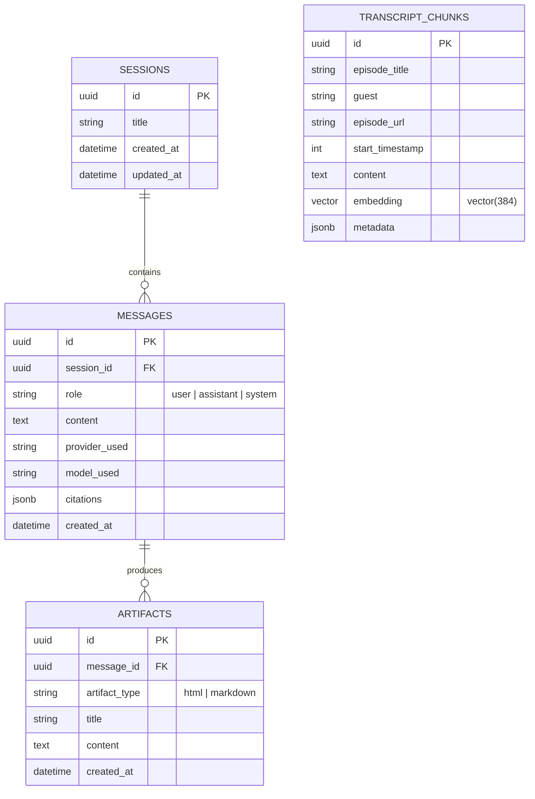
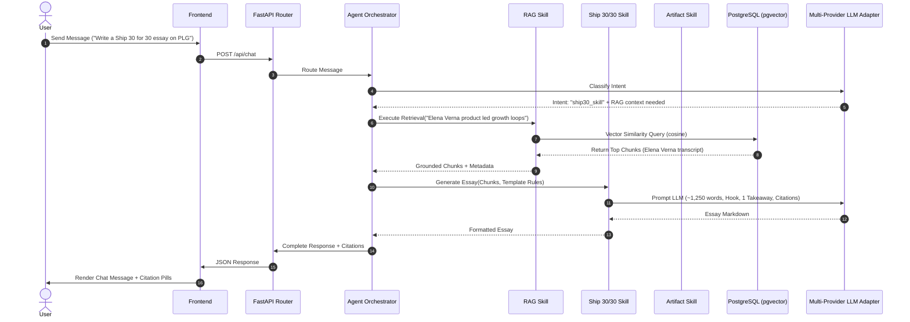

# Architecture Specification (`architecture.md`)
## Project: The Lenny Growth Assistant

---

## 1. System Overview & Component Boundaries

The system is built as a clean, decoupled 3-tier application:

```
+-----------------------------------------------------------------------------------+
|                                 FRONTEND TIER                                     |
|  Single Page Application (HTML5 / Vanilla JS / Glassmorphic CSS)                   |
|  - Chat Stream & Session State Controller                                         |
|  - Sandboxed <iframe> Artifact Renderer                                           |
+-----------------------------------------+-----------------------------------------+
                                          | REST API (HTTP / JSON)
                                          v
+-----------------------------------------------------------------------------------+
|                                  BACKEND TIER                                     |
|  FastAPI Application (Python 3.11)                                                |
|  - API Routing & Pydantic Validation                                              |
|  - Agent Orchestrator & Intent Router                                             |
|  - Multi-Provider LLM Adapter (Claude 3.5 Sonnet / OpenAI GPT-4o / Ollama)        |
|  - Skill Suite:                                                                   |
|      1. RAG Transcript Retrieval & Citation Engine                                |
|      2. Conversational Session Memory & Isolation Engine                           |
|      3. Ship 30 for 30 Essay Generator Engine (~1,250 words)                       |
|      4. Artifact Code Synthesizer (Markdown / HTML+CSS)                           |
+-----------------------------------------+-----------------------------------------+
                                          | Async SQLAlchemy / asyncpg
                                          v
+-----------------------------------------------------------------------------------+
|                                 DATABASE TIER                                     |
|  PostgreSQL 16 + pgvector Extension                                               |
|  - Table: `sessions` (Chat sessions)                                              |
|  - Table: `messages` (Conversation turn history)                                  |
|  - Table: `transcript_chunks` (384d vector embeddings & episode metadata)         |
|  - Table: `artifacts` (Generated HTML/CSS code & specs)                           |
+-----------------------------------------------------------------------------------+
```

---

## 2. Database Schema & Data Models

### 2.1 Entity Relationship Diagram (ERD)



---

## 3. API Endpoints Contract

### Health Diagnostics
- `GET /health` -> `{ "status": "ok", "timestamp": "...", "version": "1.0.0" }`
- `GET /health/db` -> `{ "status": "ok", "database": "postgresql", "pgvector_enabled": true }`
- `GET /health/llm` -> `{ "status": "ok", "active_provider": "claude", "active_model": "claude-3-5-sonnet-20241022", "fallback_available": true }`

### Sessions & Chat
- `GET /api/sessions` -> List all active chat sessions.
- `POST /api/sessions` -> Create a new chat session.
- `GET /api/sessions/{session_id}/messages` -> Get conversation history for session.
- `DELETE /api/sessions/{session_id}` -> Delete session and messages.
- `POST /api/chat` -> Send message to assistant.
  - **Request**: `{ "session_id": "...", "message": "...", "provider_override": "ollama|claude|openai" }`
  - **Response**: `{ "session_id": "...", "reply": "...", "skill_used": "ship30_skill", "citations": [...], "artifact": {...} }`

### Artifacts
- `GET /api/artifacts/{artifact_id}` -> Retrieve raw artifact payload for sandboxed rendering.

---

## 4. Agent Router & Skill Execution Flow



---

## 5. Security & Isolation Architecture

Artifact generation creates standalone HTML/CSS code. To execute this code safely:
1. **Isolated Iframe**: Rendered in `<iframe sandbox="allow-scripts" srcdoc="...">`.
2. **Same-Origin Access Blocked**: Lacks `allow-same-origin`, keeping it in a unique null origin.
3. **Storage Access Prevented**: Browsers strictly forbid null-origin iframes from reading parent `localStorage`, `sessionStorage`, or `document.cookie`.
4. **Network Restrictions**: Injection of CSP headers restricts outgoing AJAX/WebSocket connections.
